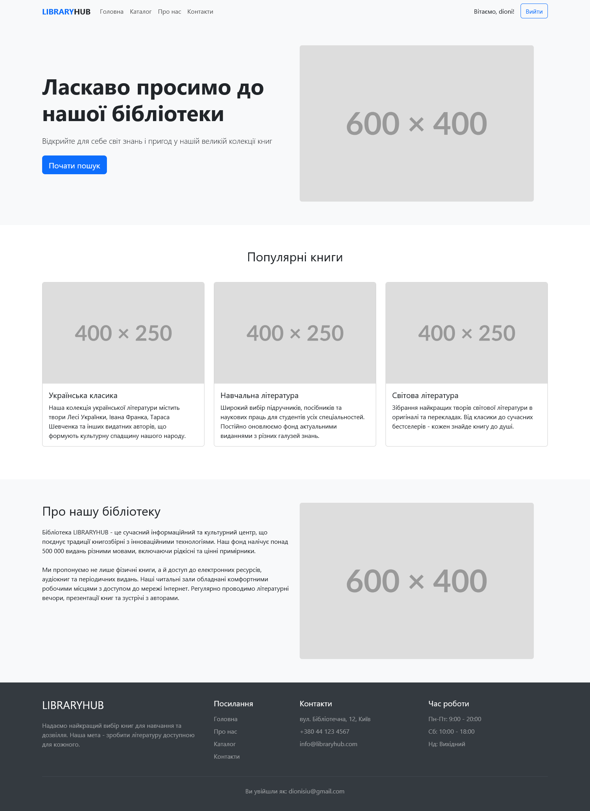
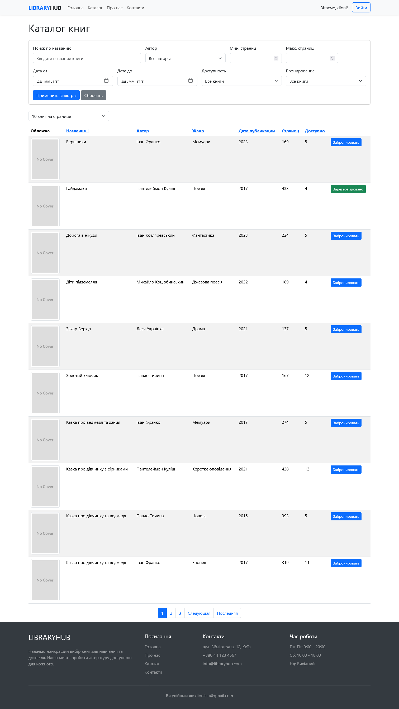

# Kursach Backend Django

Проєкт Kursach Backend Django — це веб-додаток, розроблений з використанням фреймворку Django. Він призначений для управління бібліотекою та надає API для взаємодії з даними про книги, користувачів та інші ресурси.

## Основні функції

- **Адміністративна панель**: Вбудована адміністративна панель Django для управління даними.
- **REST API**: Використання Django REST Framework для створення API, що дозволяє взаємодіяти з даними.
- **Обробка медіафайлів**: Підтримка завантаження та обробки медіафайлів.
- **Система авторизації**: Безпечна авторизація та аутентифікація користувачів.

## Встановлення

1. Клонуйте репозиторій:
   ```bash
   git clone <URL_репозиторію>
   ```
2. Встановіть залежності:
   ```bash
   pip install -r requirements.txt
   ```
3. Налаштуйте базу даних у файлі `kursach_backend_django/settings.py`.
4. Виконайте міграції:
   ```bash
   python manage.py migrate
   ```
5. Запустіть сервер розробки:
   ```bash
   python manage.py runserver
   ```

## Використання

Після запуску сервера ви можете отримати доступ до адміністративної панелі за адресою `http://127.0.0.1:8000/admin/` та до API за адресою `http://127.0.0.1:8000/api/`.

## Структура проєкту

```
kursach_backend_django/
├── api/                  # Додаток для API
│   ├── serializers.py    # Серіалізатори для API
│   ├── urls.py           # URL-маршрути API
│   └── views.py          # Представлення API
├── library/              # Основний додаток бібліотеки
│   ├── models.py         # Моделі даних
│   ├── admin.py          # Налаштування адмін-панелі
│   └── views.py          # Представлення для сайту
├── media/                # Медіафайли
├── static/               # Статичні файли (CSS, JS)
├── templates/            # HTML-шаблони
└── manage.py             # Керуючий скрипт Django
```

## Документація API

API надає такі кінцеві точки:

- **GET /api/books/** - отримати список усіх книг
- **POST /api/books/** - додати нову книгу
- **GET /api/books/{id}/** - отримати інформацію про книгу
- **PUT /api/books/{id}/** - оновити інформацію про книгу
- **DELETE /api/books/{id}/** - видалити книгу

## Ліцензія

Цей проєкт поширюється під ліцензією [MIT License](https://opensource.org/licenses/MIT).

## Скріншоти сайту 

---
### Головна сторінка

### Сторінка каталогу


## Вимоги до системи

- Python 3.8 або вище
- Django 3.2 або вище
- PostgreSQL

## Контакти

Якщо у вас є питання або пропозиції щодо проєкту, звертайтеся за електронною адресою: aleks009pip@gmail.com
